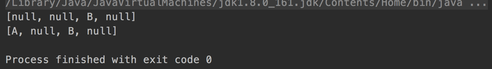
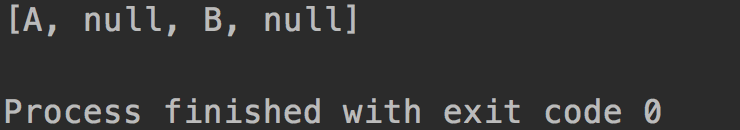

# 为什么可以向List里add null？

看一段代码：

```java
public static void main(String[] args) {
        List<String> strs = new ArrayList<>();

        strs.add("A");
        strs.add(null);
        strs.add("B");
        strs.add(null);
        strs.set(0,null);

        System.out.println(strs);

        String[] strArr = new String[]{"A",null,"B",null};
        System.out.println(Arrays.toString(strArr));
}
```

输出：




向List里添加了几个null，在遍历List的时候，可以顺利打印出来。但是我想不到为什么List里要允许有null，它代表什么含义？集合List里有一个元素是null，该元素以后还会进行初始化吗。又或者，从数据库或者其他数据源里查询出来的数据存在null，对调用者来说有什么意义呢(一般都是直接过滤掉吧)。

可见，List里是允许添加null元素的，有两个问题：

1. 什么情况下需要向List里加入null？它的意义何在。
2. 对于集合的遍历，是不是要对每一个元素做判空处理？有没有比较优雅的写法？

参考了下面的回答：

<https://softwareengineering.stackexchange.com/questions/163489/why-does-java-util-arraylist-allow-to-add-null>

简单总结一下：

1、为什么List允许有null?

- Jdk设计集合框架的时候，参照Array的API设计的，Array里允许有null，因此ArrayList等也允许。(我觉得算是个理由)
- null在集合里是可能有业务含义的。
- 也有人觉得JDK设计得不完美...

2、如何优雅的判空？

- 就每次调用前判空一下就好了，要么就自己写个包装类MyArrayList，过滤掉null的值。但是大部分场景貌似不需要。

扩展问题：

1. 数组是否允许有null？

1. ```java
   public static void main(String[] args) {
       String[] strArr = new String[]{"A",null,"B",null};
       System.out.println(Arrays.toString(strArr));
   }
   ```

   输出：

   

   允许

2. 函数式编程能否改进这种情况？

