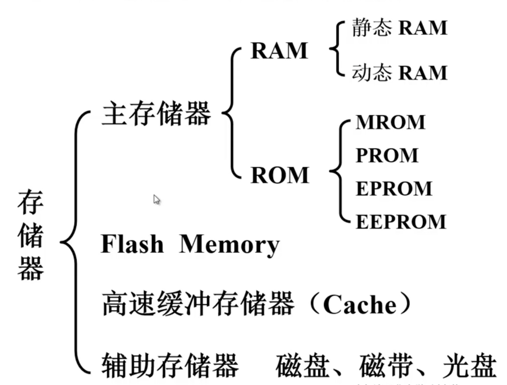
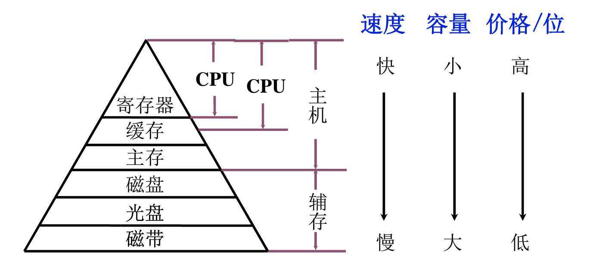
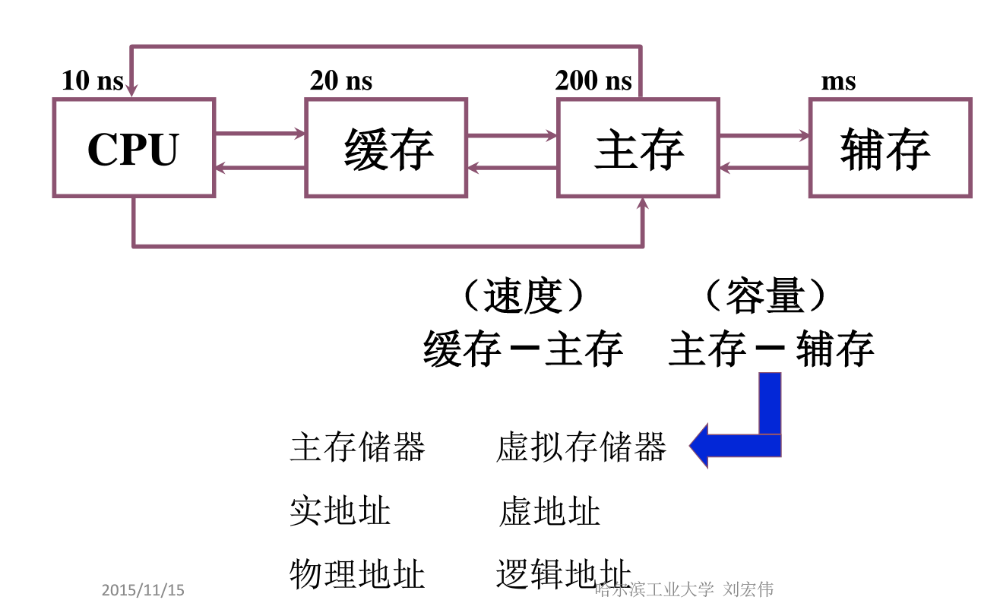

#   Chapter4 存储器1：主存简单模型与寻址

[TOC]

## 概述

- **主存储器**

- 高速缓冲存储器

- 辅助存储器

## 存储器的分类

### 1、按存储介质分类

(1)半导体存储器     易失(不通电，存储的数据易失)

- TTL(晶体管晶体管逻辑的，功耗低、集成度低、速度快)
- MOS(金属氧化物半导体，功耗低、集成度高)内存主要使用这种结构

(2)磁表面存储器

- 磁头
- 磁载体

(3)磁芯存储器

(4)光盘存储器

### 2、按存取方式分类

(1)存取时间与物理地址无关(随机访问)

- 随机存储器   在程序的执行过程中可读可写
- 只读存储器   在程序执行过程中只能读

(2)存取时间与物理地址有关(串行访问)

- 顺序存取存储器   磁带
- 直接存取存储器   磁盘

### 3、按在计算机中的作用分类

### 4、综合分类

.assets/1586012050246.png)

## 存储器的层次结构

### 1、存储器的三个主要特性的关系

### 2、性能指标：

.assets/1586012352837.png)

### 3、缓存-主存层次和主存-辅存层次

存储系统层次结构主要体现在**缓存-主存**和**主存-辅存**两个存储层次上。  

**缓存-主存层次主要解决CPU和主存速度不匹配的问题**，**主存-辅存层次主要解决存储系统的容量问题** 。

**主存和缓存**之间的数据调动是由**硬件**自动完成的，对程序员是透明的。

**主存-辅存**层次逐渐形成了**虚拟存储系统**，在这个系统中，程序员编程的地址范围与虚拟存储器的地址空间相对

#### 局部性原理

> 局部性原理分为时间局部性和空间局部性。
>
> 时间局部性是由于程序中存在循环，在运行过程中，曾经访问过的数据可能很快被再次访问，因此利用缓存保存近期被访问过的数据可以提高存取速度。
>
> 空间局部性是由于逻辑上相邻的数据在存储器中顺序存放，访问过其中一个元素后接下来很可能访问与该元素相邻的其他元素，将与当前使用过的数据相邻的其他数据从辅存调入主存可以提高存取速度。

## 主存储器简单模型

### 1、主存的基本组成

.assets/1581256846746.png)

### 2、主存储器详细结构

- 存储体：存储数据。
  - .assets/1581257234065.png)
    - 存储元：能存储一个bit的二进制位数据。假设从存储器中读取信息。图中的存储元，存了一个二进制位数据.assets/1581257538904.png)，通过控制元件.assets/1581257572112.png)的开关控制，它能向外输出一个信号，表示它存储的二进制位数据
    - .assets/1581257650248.png)用红色线同时控制多个存储元，绿色线可以同时写入或者读出存储元中的数据。比如，读取数据时，红色线控制这些存储元可以被读出，这些存储元的数据从绿色线输出。
    - 红色线对存储元的分组，叫**存储单元**，而这些存储元构成的矩阵叫**存储体**。
    - 以上都是硬件实体
    - 通电的时候，每一个存储单元的电信号组合是**存储字**，存储字的 长度叫**存储字长**
    - 存储体一次只能有一行存储单元有效，其他行存储单元失效，这样才能使输出的数据在绿线上有效
- MAR：存储器地址寄存器
- MDR：存储器数据寄存器
- 控制电路：控制读写
  - 片选线：确定哪个存储芯片被选中，可用于扩容（存储字的扩充和存储位的扩充）
  - 读写控制器：决定芯片进行读/写操作
- 译码器（译码驱动）：将来自地址总线（MAR）的地址信号翻译成对应存储单元的选通信号，将信号在读写电路的配合下完成对被选中单元的读/写操作

存储体的实现细节：

.assets/1581258445543.png)

存储器的实现逻辑：

.assets/1581258458366.png)

- 存储矩阵：由大量相同的位存储单元阵列构成
- 译码驱动：将来自地址总线的地址信号翻译成对应存储单元的选通信号（红线），该信号在读写电路的配合下完成对被选中单元的读写操作。
- 读写电路：包括读出放大器和写入电路，用来完成读写操作
- 片选线：确定哪个存储芯片（一个存储器中有多个存储芯片）被选中，可用于容量扩充。
  - .assets/1581264079691.png)
  - 例子：用16K*1位的存储芯片组成64k *8位的存储器
    - 每一个存储芯片是16 * 1位，8个芯片为一组，可以组成16*8的芯片组，只要每次对8个芯片同时读写，就可以实现8位的效果
    - 64K则需要4组芯片能满足地址的要求，因此一共需要32个芯片
    - 每一组的地址要重新分配，比如第一组的地址范围就是0-(2^16-1)，以此类推
- 地址线：单向输入的，其位数与存储字的个数有关
- 数据线：双向的，其位数与读出或写入的数据位数有关
- 数据线数和地址线数共同反映存储芯片容量的大小。如地址线10根，数据线8根，容量=2^10 * 8 =8K位 

单位：K:2^10            M:2^20          G:2^30        T:2^40  ​

### 3、寻址

- 什么是寻址 ？.assets/1581259322398.png)
  - 假设一个存储矩阵，它的存储字长是4B，每一行是4个存储单元，每个存储单元8bit，总位数32位，它的总容量是1KB。那如果我想找到某一个存储单元，我应该怎么找到它，这就是寻址。**存储器就像一个很大的下标从0开始的一维数组，地址就相当于数组的下标。**
  - 按字节寻址（编址）：每个存储字一个地址，1K个单元，每个单元1B，1K个地址；
  - 按字寻址（编址）：每一个存储字是4B，存储容量是1KB，那么按字划分，这个存储体的存储字个数就是1KB/4B = 256个单元。这256个单元如何分配地址呢？观察(右上角图)，其 实每个存储字4个存储单元，后两位就可以对这4个存储单元编址了，因此剩下的高位可以作为存储字的地址，所以256个存储字中，每个存储字的第一个存储单元的地址作为存储字的地址。
  - 多字节存放：大端方式/小端方式

## 半导体存储器RAM：SRAM与DRAM的比较

.assets/1586009412572.png)

### RAM:随机存储器

- 随机存取存储器RAM：读数据的时间跟物理存储位置无关，基本就是电流流过的时间
- RAM都是以电信号存储01，有断电就丢失信息的特性，属于易失性存储器

#### SRAM：静态随机存储器

- SRAM使用一个双稳态的触发器存储信息，读信息就是查看触发器的状态，写信息就是改变触发器的状态。非破坏性读出。
- 速度较快，常用作cache

#### DRAM：动态随机存储器

- DRAM是用电容充放电存储信息，读出时连接电容，检测电流的变化，因此读完信息要重新充电。属于破坏性读出。写信息就是给电容充放电。
- DRAM需要刷新，因为电容上的电荷最多只能维持1-2ms。
- 目前主流的DRAM都是SDRAM，同步动态随机存储器
- 容量大，常用作主存

#### DRAM的刷新

.assets/1586010174840.png)

- 什么是刷新？
  - 电容上的电荷最多能维持2ms，刷新就是重新给电容充电，让其保持数据的状态
- 多久刷新一次
  - 一个刷新周期：一般为2ms
- 每次刷新多少存储单元
  - 已行为单位，每次刷新一行存储单元
- 刷新的时间叫做死区

.assets/1586010508245.png)

- 如何刷新
  - 读出一行信息后，重新写入，占用一个读写周期
- 什么时候刷新
  - 分散刷新
    - 每次读写完都刷新一行
  - 集中刷新
    - 2ms内集中安排时间全部刷新，有一段时间专门用于刷新，无法访问存储器，称为访存“死区”
  - 2ms内每行刷新一次即可
    - 2ms内产生128次刷新请求，则每隔2ms/128=15.6us 刷新一次

.assets/1586010817766.png)

.assets/1586010916154.png)

## 只读存储器ROM（了解）

RAM具有掉电易失的特点，如果停电，那RAM里的数据和指令全部丢失。

ROM能够在掉电之后不丢失关键信息，又能和CPU通信。

.assets/1586011348311.png)

- CPU在开机之后就会去主存中取指令，一旦断电之后，主存里的指令和数据就会丢失，那么CPU就无法工作了。因此我们需要一种**既能和CPU通信又能存指令的存储器**。这就是只读存储器ROM的作用和特点。

- 只读存储器：一开始是只能读，其中的指令是制造商写死的，后来逐渐发展出可读写的ROM。如上图。

## 主存总结回顾

.assets/1586011632239.png)

- 主存基础模型结构
  - 各种线的作用
- RAM的特点和两种类型和特点
  - 结合结构理解特性
- ROM的特点