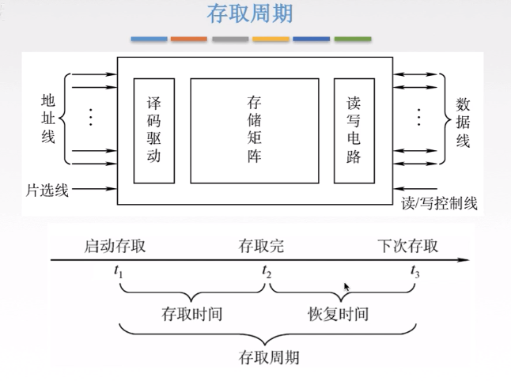
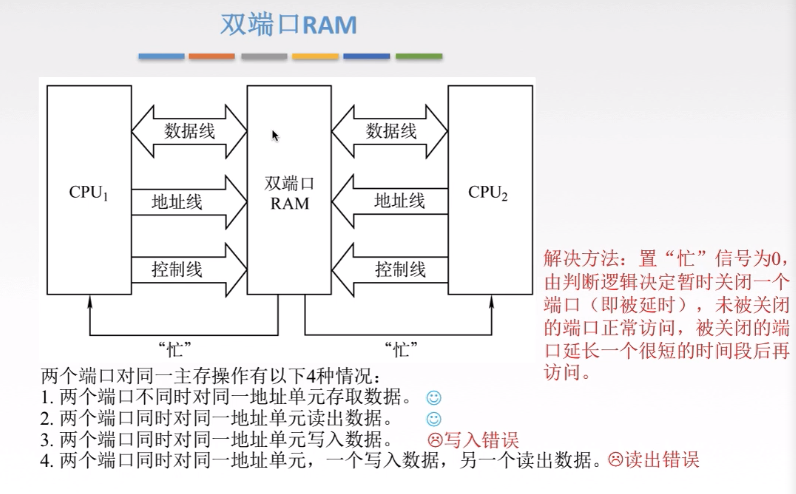
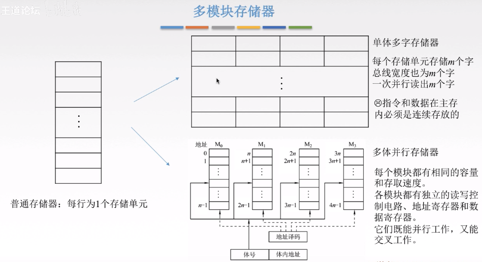
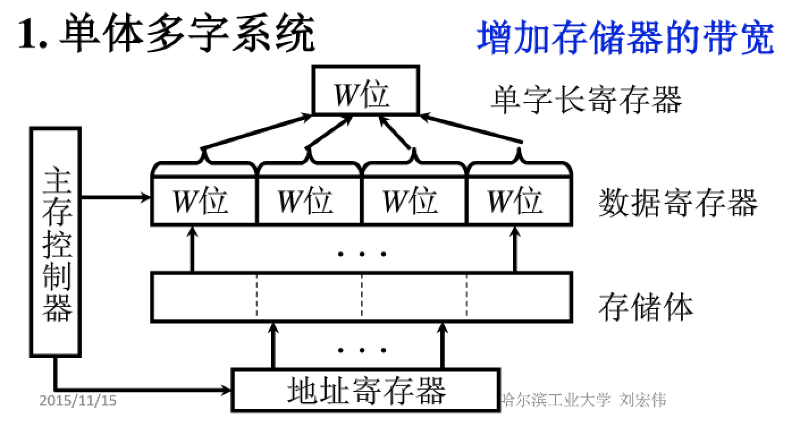
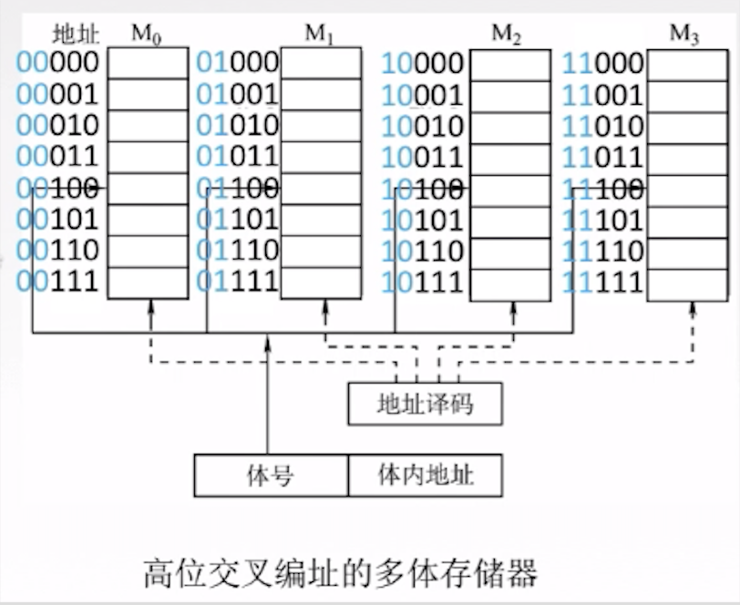
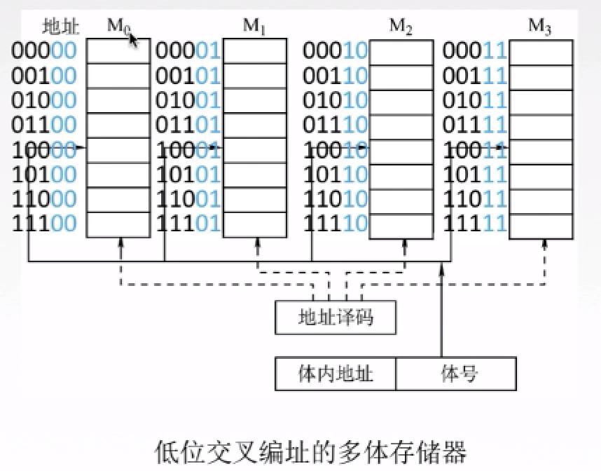
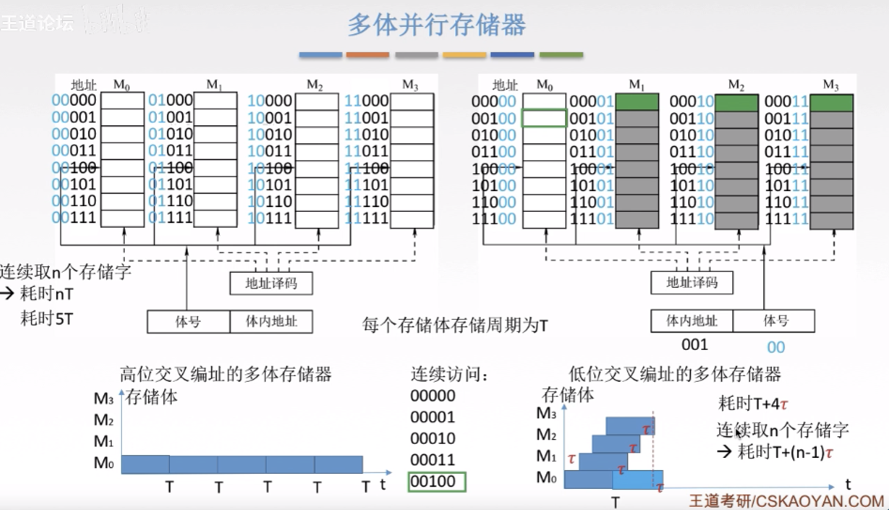
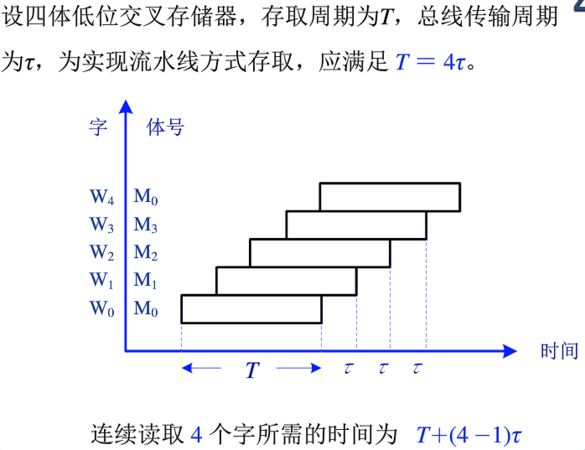

# Chapter4 存储器3：提高访问速度的措施

> CPU的速度指数型增长；主存的速度线性增长，容量倒是增加的很快。因此主存的速度影响了性能。

## 预备知识：存取周期

- 存取周期衡量存储器的工作速度

- 存储周期=存取时间 + 恢复时间
- 为什么会有恢复时间？
  - 因为内存DRAM要刷新
- 提高存储器的工作速度，也就是降低存储周期，重点就是如何把恢复时间利用上
  - 对多个不同时间能够进行不同存取的存储单元进行并行操作
  - 采用流水线方案，当某个单元进入恢复时间的时候，就进行别的操作，把恢复时间利用上

## 提高访存速度的措施

- 采用高速器件
  - 
- 采用层次结构 Cache-主存
  - Cache速度快，如果能够更多的命中Cache，那么整体速度会提高很多
- 调整主存结构（下面的两种方式都是这种方式）
  - 双端口RAM
  - 多模块存储器
    - 单体多字系统
    - 多体并行存储器

## 双端口RAM

两个CPU访问同一个RAM，其中有四个情况，如上图。其解决办法就是置一个忙信号。

对于速度提升有限，但是对于CPU通信的特殊结构有帮助。了解即可。

## 多模块存储器

### 单体多字存储器

单体多字就是把几个存储体拼成一个存储体，一个存储单元有多个字。CPU存取的时候，把多个字整体存取。

比如，CPU是16位的，也就是一次访存能查到16位数据；而内存是4个16位的存储体拼成的单体多字存储器共64位。这样CPU一次访存就能让它带走64位，4组数据，通过这种方式提高内存的访问速度和带宽。

缺点：

1、写入数据的时候会比较复杂，比如一次访存，我只想改变一个存储单元中的16位数据。CPU要先写16位到单字长寄存器，然后再写到64位的数据寄存器中，最后写到内存中。这样虽然我只想写入16位，但是还有其他的48位也被写入到内存里，可能造成错误修改。如果要正确实现，需要更复杂的器件。

2、如果我们想取得数据不是连续的地址，比如我第一次访存取64位，其中第一条指令就是jal跳转指令，且跳转的地址不在这64位中，那么这一次访存其实只有这一个指令有效，还需要再去访存，效率低。

### 多体并行存储器的编址模式

多体并行

- 假设每个存储体都有相同的容量和存取速度
- 每个模块有独立的读写控制电路、地址寄存器和数据寄存器

#### 高位交叉编址的多体存储器

高位交叉编址：

如图，一共4个存储体，CPU传来了5位地址信号，我们用前2位作为存储体的片选信号，用后3位作为存储体内的地址信号，在同一个存储体内顺序编址。看高位，相同的存储体具有相同的2位高位。

#### 低位交叉编址的多体存储器

低位交叉编址：

CPU传来了5位地址信号，每个存储体轮流编址，我们把连续的地址均匀的分配到每一个存储体上，然后我们发现每个存储体内，后两位可以作为存储体的片选信号，前三位作为地址信号。

两种模式的比较

高位交叉编址有个缺点，就是在访问连续的地址的时候，它会选中同一个存储体进行访存，假设每个访存周期为T，那么访问连续四个存储字的访存时间就是4T。这种模式就相当于做了位扩展，并没有提高存取速度。

低位交叉编址则可以有效降低存取时间。采用流水线方式存取。在存取第一个存储体M0的时候，可以继续对M1进行存取。

## 高性能存储芯片

- SDRAM(同步DRAM)
  - 在系统时钟的控制下进行读写，CPU无需等待
- RDRAM
  - 由Rambus开发，主要解决存储器带宽问题
- 带Cache的DRAM
  - 在DRAM的芯片内集成了一个由SRAM组成的Cache，有利于猝发式读取

