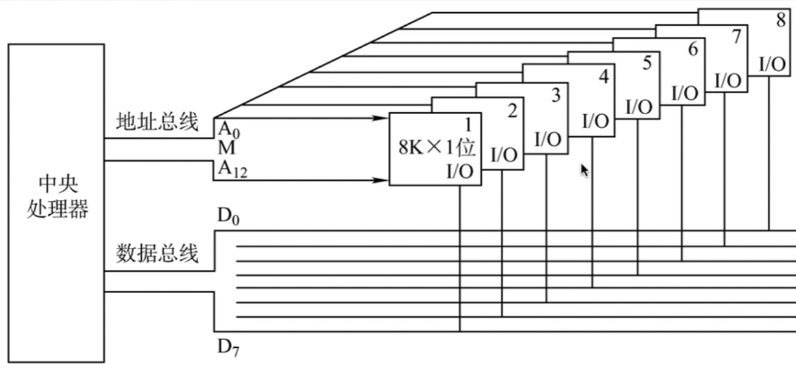
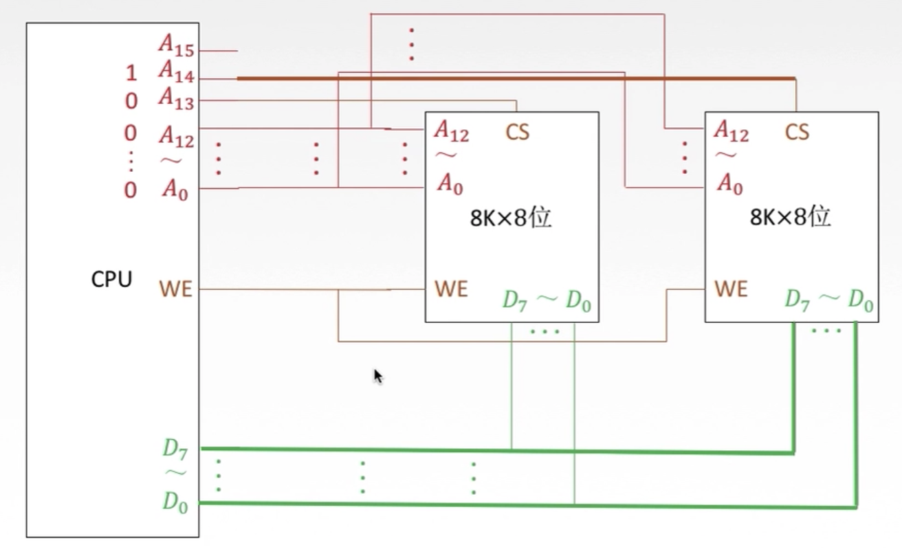
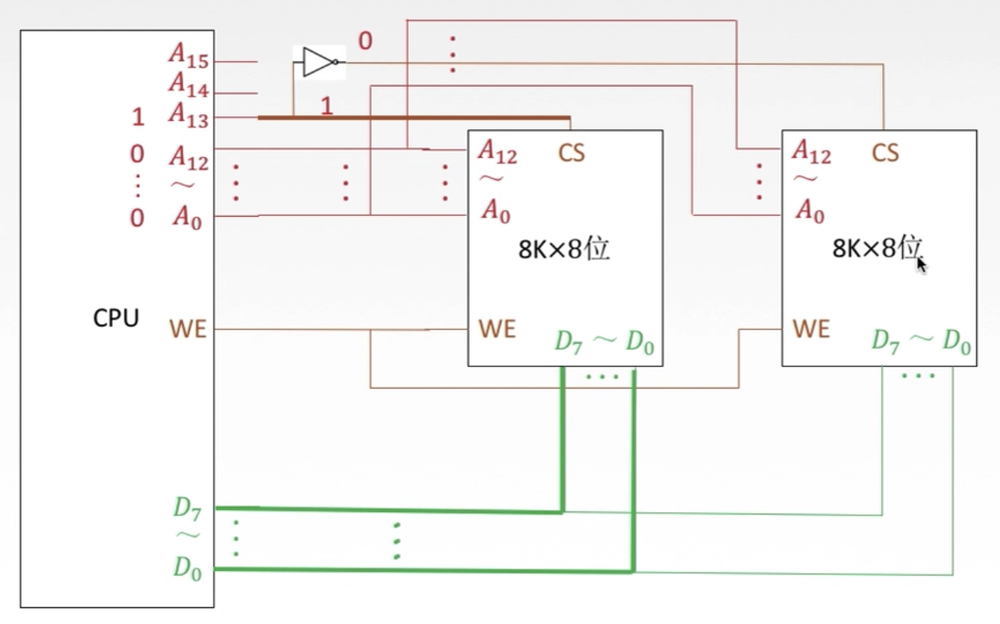
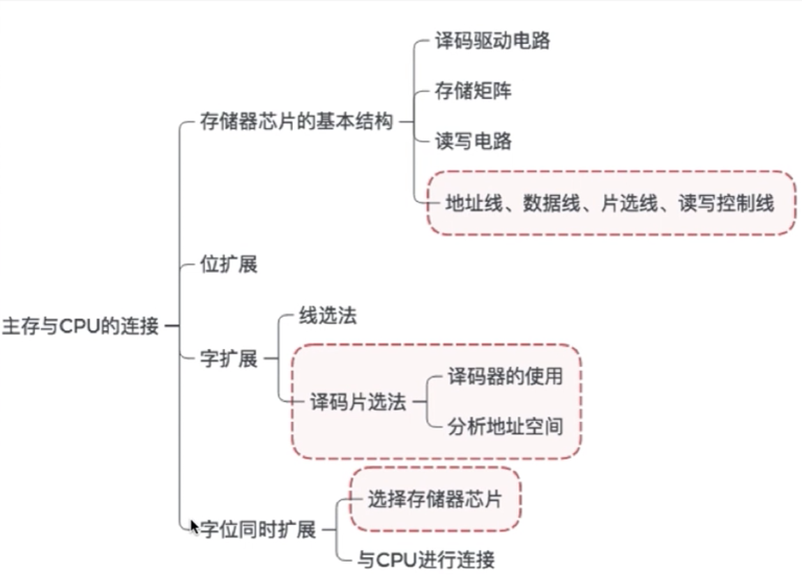

# Chapter4 存储器2：主存与CPU的连接

通常CPU的地址线比较多，寻址范围是比较大的，因此主存需要提供对应的地址范围，这就涉及到容量扩展

存储器容量扩展

- 位扩展

  - 位扩展的关键就是让多个芯片同时读写操作，具体做法就是将两个芯片的片选用相同的信号连接

  

  - 8片8K * 1 位的存储芯片  就构成了 一个8K * 8 位的存储器，容量8KB

- 字扩展（增加存储字的数量）

  - 多个芯片不能同时工作，需要用多余的地址线来控制哪个芯片选通（片选信号）线选法

  

  - 也可以把用译码器更好地利用地址线，译码片选法

    

  

  

| 线选法             | 译码片选法                       |
| ------------------ | -------------------------------- |
| n条线->n个片选信号 | n条线->2^n个片选信号             |
| 电路简单           | 电路复杂                         |
| 地址空间不连续     | 地址空间可连续，可以增加逻辑设计 |

- 同时扩展
  - 首先用位扩展，把多个芯片作为一组，主要就是扩大容量
  - 然后再做字扩展，用译码器或地址线来控制选通的芯片组

小结：

