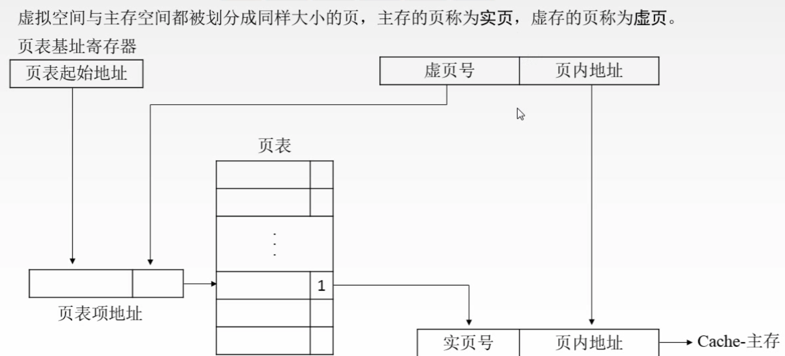

# Chapter4 存储器5: 虚拟存储器

[TOC]

###1、虚拟存储器

- 虚拟存储器是一个逻辑模型
- 功能：用户给出一个地址，叫做虚地址或逻辑地址，虚拟存储器要给出该地址对应的数据
- 实现：由辅助硬件将虚地址映射到主存当中的某个单元，主存单元地址成为实地址或物理地址

### 2、怎么从虚地址查实地址？

#### 页式存储器

虚拟空间和主存空间被分成大小相同的页，主存的页称为实页，虚存的页称为虚页

#### 段式存储器

段的大小是可变的，不需要像页一样把虚存和主存分成大小相等的页。

段页式虚拟存储器

先按逻辑结构分段，每个段内再划分为固定大小的分页。

主存空间也划分为大小相等的页。

程序对主存的调入、调出以页为单位。

每个程序对应于一个段表，每段对应一个页表

虚拟地址：段号+段内页号+页内地址

### 3、快表(TLB)

把常用的页表项放到缓存中