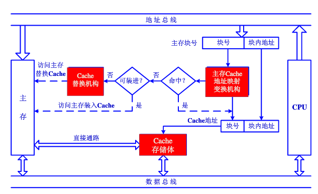
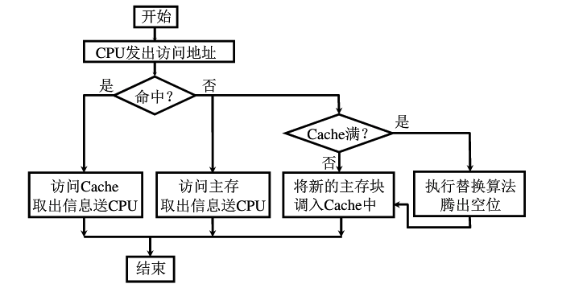

# Chapter4 存储器6: 内存读写的Java实现

1、回顾一下Cache的基本结构

2、Cache的读写操作

读：

写：

写直达(Write-Through)

写回法(Write-Back)

3、Java实现

假设主存和Cache之间采用直接映射(主存调入cache的时候，随便放)，替换算法采用LRU，即近期最少使用算法（当然其他算法也可以都试试）。

首先实现读操作。

3.1 先分析有哪些操作

- CPU送出一个主存地址，发出读取数据或指令的请求
- 在主存-缓存映射表里查找，是否缓存命中，如果命中，则返回给CPU数据，并且更新主存-cache映射表
- 如果缓存未命中，访问主存，取出信息，返回给CPU
- 判断缓存是否可装入，如果是，则取主存的数据装入缓存
- 如果缓存不可装入，则调用cache替换机构，选择替换算法进行替换操作

