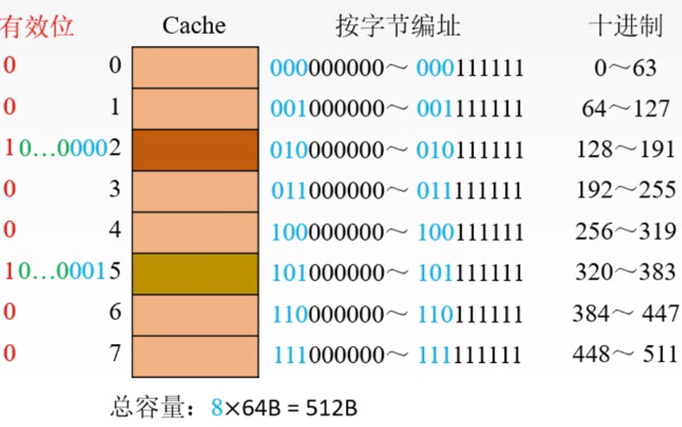

# Chapter4 存储器4：局部性原理与缓存

[TOC]

## 1、为什么要有缓存？

因为存储器和CPU的速度差距太大，主存速度跟不上，因此需要加上一个更加高速的中间层

## 2、程序的局部性原理

- 时间局部性
- 空间局部性

- 命中率：CPU要访问的数据在缓存Cache中的比例
  - 设一个程序执行期间，Cache的总命中次数为Nc，访问主存的总次数Nm,则命中率H= Nc/(Nc + Nm)

## 3、Cache的基本结构

## 4、Cache-主存的地址映射

CPU和主存之间是按机器字长为单位来交换数据的，因为寄存器比较小，一般只能和主存中很少的数据进行交换。

而Cache和主存都是存储器，因此可以用更大的单位来交换数据，Cache和主存之间交换数据的单位是块。

Cache和主存之间的地址的映射就是，我知道主存的地址，怎么找到对应的缓存的地址；我知道缓存的地址，怎么找到对应的主存的地址。很明显，他们之间需要一个第三方的映射表。

假设某个计算机的主存地址空间大小为256MB，按字节编址，其数据Cache有8个Cache行(即Cache块)，行长为64B.如下图4.1。为了方便主存和缓存的数据传输，主存的行也是64B。

- 全相连映射(空位随意放)

首先给缓存按字节编址，因为一共有8个行，可以注意到图中蓝色的三位可以代表行号，后面黑色的5位就是行内存储单元的地址范围。

图7.1

然后，给主存按字节编址

图4.2

映射表要一个有效位，判断该缓存是不是已经有数据占用了。然后主存的主存的地址分为两个部分，一个是字块内地址，这个和缓存中的位数是一样的。另一个是主存字块标记（图中绿色和蓝色的部分地址），这个标记加上有效位构成映射地址。标记位是为了让缓存知道，当前的数据是来自主存的拿个地址块。

电路复杂，速度慢，保存的位数多，比较器的长度长

- 直接映射(对号入座)

主存的块通过一定的计算方法存到某个固定的缓存块里。

主存地址 mod 缓存块数

比如，图中，第0号主存块，根据它对应的Cache地址，他就被换到Cache的第0块，同样，第一块主存块就被换到第1块Cache块。如果cache中8块都被占满了，主存中的第8块要进来，根据它对应的cache块地址，它也就只能被换到第0块。也就是每一个主存块所能进入的缓存块是固定的。相应地，映射表只需要记录有效位加上主存块地址即可，cache字块地址不需要记录。

但是，由于每个主存快分配方式固定，如果缓存中的空间未满，而主存块读到缓存块中的位置固定，则空出来的缓存块可能没有被利用到，因此缓存利用率不高。

- 组相联映射

结合上面两个方法，先分组，在组内随意放。

比如，上图中，Cache每两个cache块分为一组。则**cache的紫色两位作为组号**，**主存中的较低的两位(紫色)作为内存块对应的组号**。选地址位中较低的两位，是方便在保存映射表的时候，可以将蓝色的1位和绿色的部分一起作为内存块的标志位，假设选地址位中较高的2位作为内存和cache的映射位，则选择内存块地址位的时候，还要再跳一位，较麻烦。

分为多少组，专业点叫分为多少路。

比较：

## 5、替换算法

如果cache块满了，这时需要一个新的内存块加载进来，用什么策略来替cache块

- 随机算法(RAND)：随机地确定替换的cache块。实现比较简单，但是没有利用到程序的局部性原理，缓存命中率可能较低
- 先进先出(FIFO)：选择最早调入的进行替换。实现容易，但是也没有利用程序的局部性原理，可能把一些需要经常使用的程序块(如循环程序)也作为最早进入cache的块替换掉
- 近期最少使用算法(LRU)：依据程序访问的局部性原理，选择近期内长久未访问过的存储行作为替换的行，平均命中率比FIFO高，是堆栈类算法。
  - LRU算法对每行设置一个计数器，cache每命中一次，命中行的计数器清0，其他行计数器加1，需要替换时，比较个特定行的计数值，将计数值最大的行换出
- 最不经常使用算法(LFU):将一段时间内被访问次数最少的存储行换出。每行也设置一个计数器，新行建立后从0开始计数，每访问一次，被访问的行计数器加1。需要替换时比较各特定行的计数值，将计数值最小的行换出。

Q:CPU 如何判断cache是否命中呢？

A:相联存储器：并行比较标记，若有标记与当前将要访问的地址的标记相同且有效位为1，则命中。若标记不同且有效位为1，则根据替换策略替换。 

## 6、写策略

### 缓存命中时：

当缓存命中的时候，CPU改变了缓存里存储块的内容，为了保证缓存和内存的数据一致性，需要将缓存里的数据写到内存里，写的策略有写会法（Write-Bac）和全写法(write-Through)

#### 写回法(Write-Back)

缓存命中时，改变了缓存块的内容，此时不直接写回到内存里，因为相较于CPU和缓存，写内存的操作还是比较费时的。在改变cache块内容的同时，给该块添加一个**脏位**，表示该块已经被写过了。当该块数据不再被需要了，被踢出缓存（换出）的时候，再写回到主存里。

#### 全写法(Write-Through)

当CPU对cache写命中时，必须把数据同时写入cache和主存，一般使用写缓冲（write-buffer）。即增加一个队列，暂存被写的数据，然后异步地写入内存。所以，全写法虽然是对cache和内存都进行修改，但是对两者的修改实际是不同的。但是如果缓存命中频繁，缓冲队列可能溢出。

### 未命中时：

#### 写分配法(Write-Allocate)

写分配法就是把主存中的块调入cache，在cache中修改。因为写cache比较快，CPU在cache中没有找到数据，cache主存地址映射变换机构找到该内存块对应的cache地址，然后CPU直接写cache，并且在cache块上设置脏位，就变成了写回法。需要搭配写回法使用。

#### 非写分配法(Non-Write-Allocate)

只写入主存，不调入cache。搭配全写法使用。

写策略小结：

写入速度快，并且考虑了局部性原理

具有好的数据一致性，但是写入慢，且频繁写的时候，可能缓冲区溢出

多级缓存

L1和L2之间用全写法，L2和内存之间用写回法

