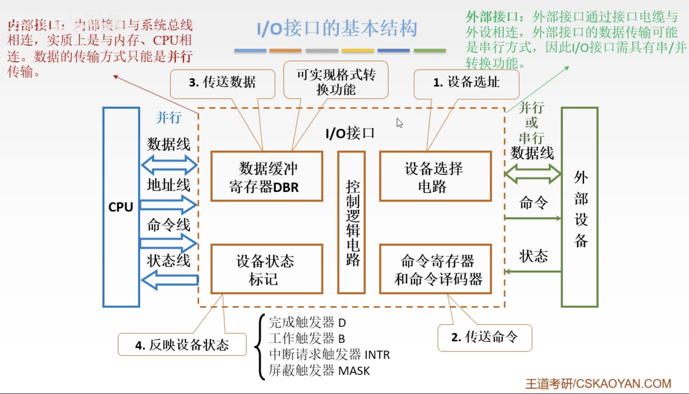
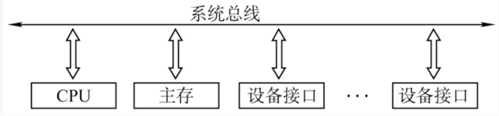
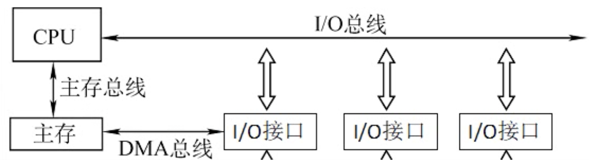

# Chapter5 I/O接口

[TOC]

- 主要功能
- 组成
- IO端口及编址

## IO接口

## IO接口功能

- 设备选址-设备选择电路
- 传送命令-命令寄存器和命令译码器
- 传送数据-数据缓冲寄存器DBR，一次传输一个机器字长，并且可实现格式转换功能
- 反映IO设备的工作状态-实际上是一个位，即一条线连接主机，用不同的位表示不同的设备状态

一个读写过程：

首先CPU会发送设备选择的命令，指定设备的地址，命令经地址线传到设备选择电路，判断是否有此设备的地址，如果有，则选中设备。并把相应的设备状态反馈给CPU。

 CPU收到设备就绪的命令之后，通过命令线发送控制命令，到命令寄存器，命令译码器将命令转成外设控制信号，将控制命令送到外设侧的命令线，并控制外设进行输入输出。

假设是输入命令，外设将数据并行或串行地通过数据线传入数据缓冲寄存器，输入完成后，通过状态线更新设备状态标记，告诉IO接口输入完成，IO接口向CPU发送反馈(比如发送中断请求)，如果CPU决定响应中断，就会将中断响应的命令通过命令线传给IO接口。

IO接口接受到中断响应之后，并不是直接将DBR中的数据传给CPU，而是传一个中断向量（类型）号，这是因为CPU在发送完最开始的读取设备的指令之后就去做执行其他指令了，不记得自己要找哪个设备执行什么操作了，因此中断向量号就是告诉CPU之前针对什么设备执行了什么命令。

## 接口与端口

- 接口Interface
  - 端口Port
    - 数据端口  读&写
    - 控制端口  写
    - 状态端口  读
  - 控制逻辑

IO端口就是指接口电路中可以被CPU直接访问的寄存器。

IO端口要想能够被CPU访问，必须要有端口地址，每一个端口都对应着一个端口地址。

## IO端口及其编址

### 统一编址

把IO端口当做存储器的单元进行地址分配，用统一的访存指令就可以访问IO端口，又称**存储器映射方式**

靠不同的地址码区分内存和IO设备，IO地址要求相对固定的地址的某部分

优点：不需要专门的输入输出指令，可使用CPU访存指令，访问IO的操作更灵活、更方便，还可使端口有较大的编址空间

缺点：端口占用了存储器地址，是内存容量变小，而且，利用存储器编址的IO设备进行数据输入输出操作，执行速度相对较慢

### 独立编址

这种模式下，IO总线是**专门用来传输IO指令的**，主存总线是主存和CPU交换数据的，因此IO设备的编址可能和主存中的**编址重复**，因此就需要做区分，靠**不同的指令**区分内存和IO设备。

 优点：输入输出指令与存储器指令有明显区别，程序编址清晰，便于理解

缺点：输入输出指令少，一般只能对端口进行传送操作，尤其需要CPU提供存储器读写，IO设备读写两组控制信号，增加了控制的复杂度