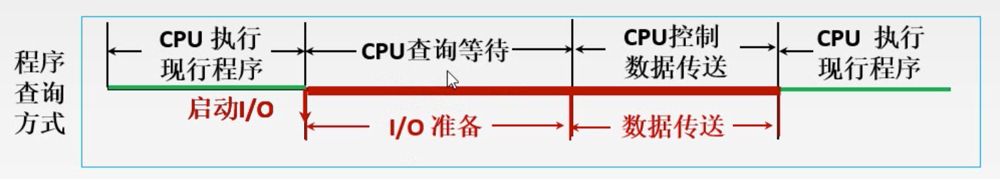
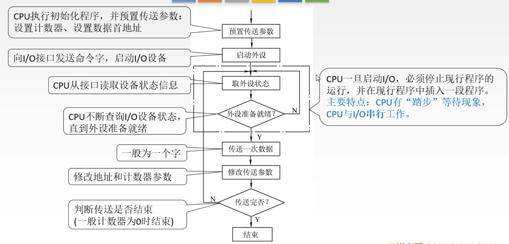
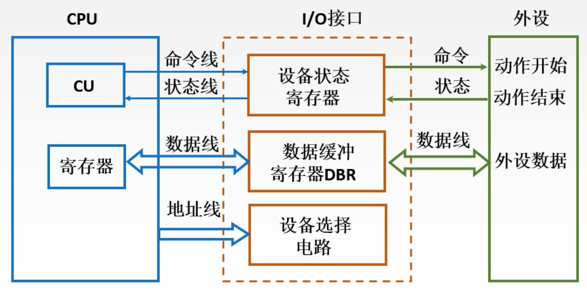

# Chapter5 I/O方式

## 程序查询方式

### 程序查询方式的流程图：

### CPU程序执行流程：

优点：接口设计简单，设备量少

缺点：CPU在信息传送过程中要花费很多时间用于查询和等待，而且在一段时间内只能和一台外设交换信息，效率大大降低

### 程序查询方式接口结构

- 适合低速外设，不适合高速外设
- CPU和IO接口之间的数据交换发生在CPU的寄存器和IO接口中的数据缓冲寄存器之间，因此数据交换单位是一个字

## 中断

### 中断的基本概念

程序中断是指计算机执行现行程序的过程中，出现某些急需处理的异常情况或特殊请求，CPU暂时中止现行程序，而转去对这些异常情况或特殊请求进行处理，在处理完毕后CPU又自动返回到现行程序的端点处，继续执行原程序。

### 程序中断过程

## DMA方式

### DMA控制器

 

图片来自极客时间<https://time.geekbang.org/column/article/118657>

 最早，计算机里是没有 DMAC 的，所有数据都是由 CPU 来搬运的。随着人们对于数据传输的需求越来越多，先是出现了主板上独立的 DMAC 控制器。到了今天，各种 I/O 设备越来越多，数据传输的需求越来越复杂，使用的场景各不相同。加之显示器、网卡、硬盘对于数据传输的需求都不一样，所以各个设备里面都有自己的 DMAC 芯片了。