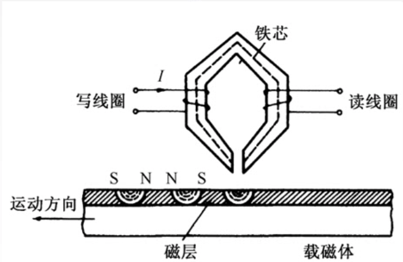

# Chapter5 外存储器

[TOC]

## 原理

磁头通过电磁感应改变磁表面的磁性，来保存信息。当磁头和磁性记录介质有相对运动时，通过电磁转换完成读写操作。

### 磁表面存储器的优点

- 存储容量大，位价格低
- 记录介质可以重复使用
- 记录信息可以长期保存而不丢失，甚至可以脱机存档
- 非破坏性读出，读出不需要再生

### 磁表面存储器缺点

- 存取速度慢
- 机械结构复杂
- 对工作环境要求高

## 磁盘存储器

磁盘结构：

存储区域：

硬盘存储器：

## 平均存取时间

平均存取时间 = 寻道时间(磁头移动到目的磁道) +旋转延迟时间(磁头定位到所在的扇区) + 传输时间(传输数据所花费的时间)

寻道：磁头移动到目的磁道

旋转：磁头定位到所在的扇区

传输：

磁头在扇区上串行转一圈

## 磁盘地址

## 磁盘工作过程

## 磁盘阵列

待完善==。

