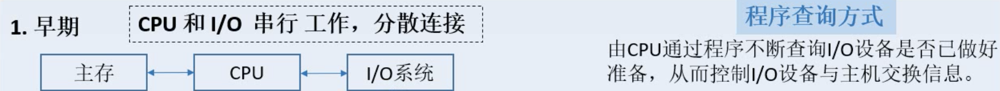
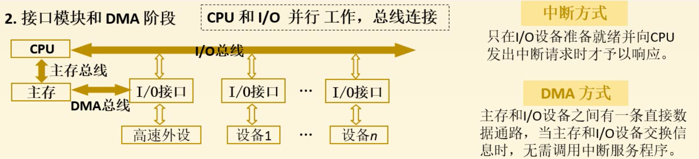
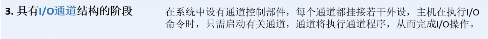
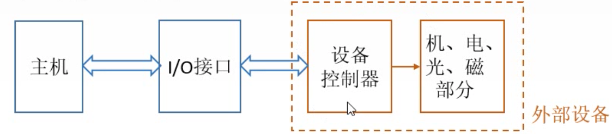
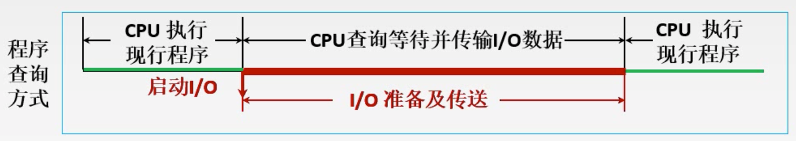
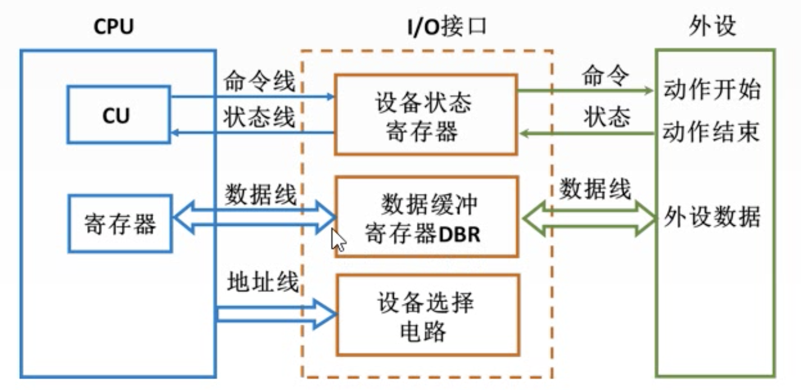
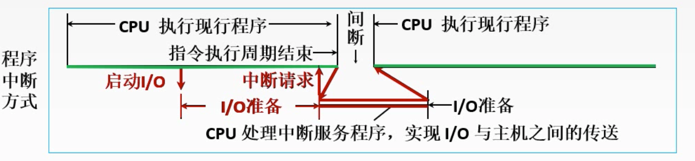
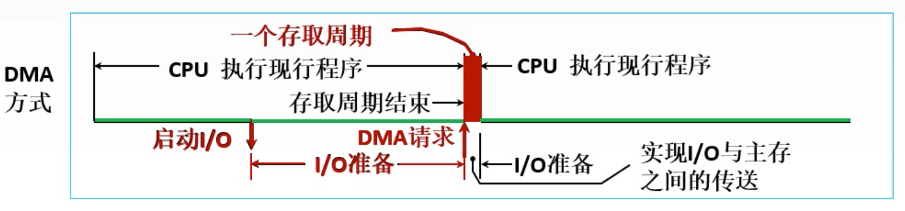

# Chapter5 输入输出系统

[TOC]

## I/O系统演变过程

**I/O系统的演变过程是一个不断解放CPU的过程**

- CPU和I/O设备分散连接
- 程序查询方式是CPU不断查询I/O设备是否准备好数据，这期间CPU处于等待状态

- 采用总线结构，将I/O设备连接在一起
- CPU和I/O设备一定程度上并行工作
- 采用中断方式，CPU在执行I/O命令时，先不直接执行，而是等I/O设备准备好数据，向CPU发送中断请求，CPU才重新读取上下文，执行I/O操作
- DMA方式：如果一些高速外设不断地向CPU发送中断请求，那么CPU就会被高速外设占据。DMA是主存和IO设备之间的直接通道，有一个DMA控制器，当CPU执行高速外设的I/O操作时，将控制权交给DMA控制器，让它来执行主存和I/O的数据交换。

- DMA方式不够灵活，后来发展出I/O通道。I/O通道有自身的指令。

## I/O系统基本组成

### IO软件

包括驱动程序、用户程序、管理程序、升级补丁等。

通常采用I/O指令和通道指令实现CPU和I/O设备的信息交换。

- I/O指令

  - CPU指令的一部分
  - 操作码-命令码-设备码

- 通道指令

  - 通道自身的指令

  - 指出数据的首地址、传送字数、操作命令

  - 通道指令放在主存中

    由CPU执行启动I/O设备的指令，由通道代替CPU对I/O设备进行管理

### I/O硬件

包括外部设备、设备控制器和接口、I/O总线

## I/O方式简介

### 程序查询方式 

- CPU执行到某条指令，进行I/O操作，启动I/O
- I/O准备数据需要一定的时间，此时CPU查询等待并传输I/O数据
- 最后I/O数据传输完成，CPU继续执行下面的指令

特点：CPU一旦启动IO，必须停止现行程序的运行，并在现行程序中插入一段程序。CPU有他踏步等待现象，CPU与IO串行工作。

优点：接口设计简单，设备量少

缺点：CPU在信息传送过程中要花费很多时间用于查询和等待，而且在一段时间内只能和一台外设交换信息，效率大大降低，不适用于高速外设

电路结构：

注：外设和CPU之间用数据缓冲寄存器交换数据，单位为字

### 程序中断方式

- CPU执行程序，遇到I/O指令，直接返回，让I/O设备去准备数据，CPU继续执行其他的指令
- I/O设备准备好数据之后，向CPU发送中断请求
- CPU将当前执行的程序保存，开始进行I/O操作，执行完I/O操作或者I/O设备继续准备数据时，CPU返回，重新读取之前的程序，继续执行程序指令
- 中断的方式能够让CPU和I/O一定程度上并行操作

### DMA方式

- CPU执行程序，遇到I/O指令，直接返回，I/O设备准备数据
- 当I/O设备准备好数据的时候，DMA控制器开始进行内存和I/O设备的数据交换，这个时候CPU是不进行访存的，或者如果此时CPU没有访存指令就继续往下执行。
- I/O设备和主存之间的数据交换是占用一个存取周期的

中断和DMA的比较：

- 中断请求发送后，CPU需要从当前执行的程序中切出来，保存当前执行的上下文，然后去执行I/O指令。执行完I/O指令，还要再读回之前的中断的程序。
- DMA方式，CPU不需要从当前程序中切出来，而是暂停对主存的访问

